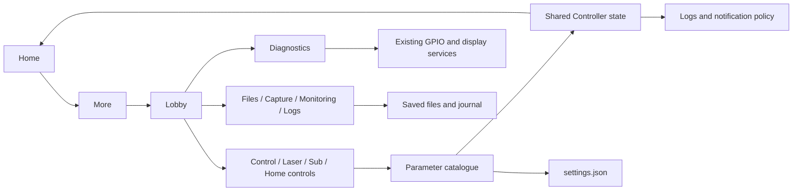

# Nexatom v1.16 ? Lobby and application tools

A separate release built from v1.15 for the **1600 ? 720 touch HMI**. The Lobby is the entry point for configuration, diagnostics, files and runtime information. v1.15 is preserved.


## Run

- **Windows:** double-click [start.cmd](start.cmd). The included Python and Qt runtime is ready to use. The normal three-second boot opens fullscreen Home.
- **Raspberry Pi OS, 64-bit desktop:** copy this folder to the Pi and run `bash start.sh` from its graphical desktop. The inherited launcher stages the app at `~/nexatom`, preserves installed settings/calibration, provisions dependencies and configures startup. Its first setup can require OS authentication or a restart.
- **Desktop window:** run `start.cmd --windowed` on Windows, or pass `--windowed` to the Pi launcher.

The GPIO, device backends, pin configuration, provisioning and startup scripts are unchanged from v1.15. This release was tested on Windows with simulated inputs; physical CM5/Raspberry Pi acceptance is still required.

## Navigation and Lobby

**Home ? More ? Lobby.** The original More-wheel animation remains unchanged. Lobby pages share the existing background, square-corner cards, fonts and theme. Back returns to Lobby; Home returns to the laser display. Sub Parameters uses Back to move up its hierarchy first. File previews close before leaving File Manager.

Twenty cards occupy a compact eight-column, six-row Bento grid. Buttons Panel, Control Parameters, Laser Config and File Manager receive the larger cards.

| Card | Function |
|---|---|
| Control Parameters | Independent CC / TC / PC columns for the selected laser; editable setpoints, toggles and read-only values. |
| Laser Config | Both lasers' current limits, current setpoints, maximum voltage, polarity and temperature. |
| Sub Parameters | Two-column parameter hierarchy with selection, child preview, Open group and Up one level. |
| Home Controls | Assign and edit each of the four Home corner parameters. |
| Buttons Panel | Configure left/right shortcuts and drag side-button rows to reorder them. |
| Diagnostics | Screen Check, Retry GPIO, Retry display, Diagnose system, input calibration and report export. |
| System Monitoring | Twelve live host/runtime readings, sampled once per second while visible. |
| Screenshot | Capture the complete display containing the application. |
| File Manager | Browse and preview screenshots, text logs, exports and other files; browse recordings. |
| Graph Size | Small / Medium / Large, applied immediately to both Home charts. |
| Logs | Separate fullscreen journal, with filtering, live/pause, export and confirmed clearing. |
| Notifications | Existing history, permissions, notification size and action-update preferences. |
| Display Settings | Existing display and appearance controls. |
| System | Existing system preferences. |
| Signals | Existing graph/function settings. |
| Help | Existing help and guided tour. |
| About | Existing instrument information. |
| DLC View | Reserved placeholder; no new DLC or assembly-viewer functionality. |
| Legal Info | Reserved placeholder for approved legal content. |
| Digital Manual | Reserved placeholder for supplied manual content. |

## Control pages and state

The supplied reference images determine the parameter groups and hierarchy; the pages retain the Nexatom Lobby styling. All numeric edits open the existing Home numpad and update the same `Controller`/`Laser` state. A number entered through Laser Config is immediately visible in Home and Sub Parameters.

**CC:** Enable CC, Set Current, Actual Current, Maximum Current Imax, Maximum Voltage Umax, Positive Polarity, Enable Feed Forward and Feedforward factor.

**TC:** Enable TC, Set Temperature, Actual Temperature, Minimum/Maximum Temperature and P/I/D regulator parameters.

**PC:** Offset, scan amplitude, scan frequency, lock setpoint and Umax.

- Enable CC uses the existing emission confirmation slider. Cancelling leaves emission unchanged.
- TC enable holds/resumes the simulator's temperature target. Feed-forward enable gates its contribution to the simulated traces.
- Current cannot exceed Imax. Imax cannot be reduced below the accepted current setpoint.
- Temperature edits must remain inside the configured temperature limits. Invalid or non-finite edits are rejected before mutation.
- Lock icons mark values that are read-only in that page, matching the reference. Umax remains available through the existing PC/Home editor.
- Home field assignments follow the laser, including when channels are swapped or duplicated. Both panels showing the same laser share its assignments.
- Accepted numeric values, assignments and TC/feed-forward flags are saved to `control_state` in `data/settings.json`, with a short debounce and a shutdown flush. Emission is not newly restored from this preference block.
- Live readbacks update at 4 Hz without recreating touch targets during a press.

Laser acquisition and readbacks remain **simulated**, as in v1.15. P retains its existing waveform effect; I/D values are editable and persisted configuration, not an implemented hardware PID loop. No new laser transport or firmware writes are introduced.


## Diagnostics and runtime monitoring

Screen Check opens directly over the Lobby and returns there. It retains the existing corner-touch, continuous-trace, drag-target and solid-colour stages. The native screen check supports the existing knob navigation commands.

Diagnose system checks writable storage, loaded preferences, journal access, the display surface, current GPIO service status, simulated acquisition and the application runtime. Results include pass/warning/fail states and can be exported as timestamped JSON. GPIO and display retries call the existing services. Diagnostic actions have moved out of the general Control Settings landing page into this area; that page links back to Diagnostics.

System Monitoring shows CPU utilisation, RAM, temperature when exposed by the host, disk space, system uptime, input status, OS, architecture, application uptime, acquisition rate and each laser's emission/sample-point state. The polling timer stops when the page closes. Unsupported host readings are explicitly shown as unavailable.

## Buttons and saved files

Left and right shortcut assignments are independent. Screenshot, Open Lobby and Open Logs are among the existing available actions. Side-button rows can be dragged with touch or mouse; Up/Down buttons provide an alternative. Ordering, shortcut assignments and label visibility persist.

Screenshots are full-display PNGs named **`screenshot_YYYYMMDD_HHMMSS_microseconds.png`**, saved in `data/screenshots`. The operation can be started from Lobby or an assigned shortcut. The filename contains the capture type and timestamp; microseconds avoid ordinary same-second collisions.

Windows/X11 uses Qt screen capture. Raspberry Pi Wayland uses the inherited `grim` compositor path, with a compatible compositor such as labwc. Failures are reported instead of substituting a window-only image. This compositor path has not been exercised on a physical Pi during this release.

File Manager provides Screenshots, Recordings, Logs, Exports, App files and User files locations, Up, Refresh and sorting by name/newest/largest. Images have thumbnails and an internal fit-to-screen preview. Text, JSON, Markdown, CSV and log files have a scrollable preview capped at 256 KB; Open externally opens the complete file. Recordings and other formats use an installed external application. Empty folders and missing/unreadable files have explicit states.

| Content | Location |
|---|---|
| Screenshots | `data/screenshots/` |
| Recordings to browse | `data/recordings/` |
| Log exports | `data/exports/logs.csv`, `data/exports/logs.md` |
| Diagnostic exports | `data/exports/diagnostics_<timestamp>.json` |
| Operator journal | `data/events.db` |
| Notification history | `data/notifications.json` |
| Runtime/error reports | `logs/`, or the selected data directory's `logs/` when using `--data-dir` |

`--data-dir <folder>` relocates preferences and the saved-file library together. File browsing does not delete or alter existing captures.

## Logs and notifications

Logs remains its own fullscreen window and returns to the preceding Home/Lobby view. It retains timestamps, descriptions, outcome, severity, filtering, live/pause, scroll-position preservation, export and confirmation before clearing. Status colours are **red** for critical/failure, **orange** for warnings, **green** for completed actions and **white** for informational/request records. Text contrast adapts to light mode while indicators retain their status colours.

Notification policy:

- Routine chart gestures, layout edits and already-visible lock/stabilisation changes are recorded in Logs instead of generating transient cards.
- Routine display detection and brightness/contrast readbacks are recorded without extra cards. Failures still surface.
- Identical notifications are suppressed for eight seconds, without restarting the original timer or duplicating its history entry.
- At most two cards are visible. The inherited bounded routine queue and protected permission/critical entries remain.
- Normal notices expire after 3.2 seconds; warnings after six seconds. A circular indicator around the close control shows the remaining time.
- Automatic dismissal retains the blur/fade transition. Manual close removes the card immediately.
- Critical errors and permission requests remain until handled and therefore have no countdown ring. Permission callbacks are never executed by expiry.
- Progress appears in both the QML Home/Lobby and the native Settings notification renderer.

## Code structure

```text
main.py                         Application composition and signal wiring
controller/
  model.py                      Laser values, parameter specifications and validation
  bridge.py                     Shared QObject API used by Home, forms and knobs
  parameters.py                 Lobby catalogue, parameter tree and persistence
interaction/
  workspace.py                  Lobby preferences, capture, files, monitoring and Logs
  diagnostics.py                Read-only checks and adapters to existing diagnostic tools
  notifications.py              Bounded queue, deduplication, deadlines and remaining time
  notification_art.py           Cached card rendering and native progress rings
qml/
  Lobby.qml                     Bento card layout and page routing
  ControlParameters.qml         Paired CC/TC/PC controls
  LaserConfig.qml               Two-laser configuration
  SubParameters.qml             Parameter hierarchy
  HomeControls.qml              Four corner assignments and editing
  ParameterRow.qml              Shared numeric/read-only/toggle/branch row
  LobbyChoice.qml               Touch-sized dropdown with bounded popup height
  FileManager.qml               Browser and image/text previews
  DiagnosticsPage.qml           Check actions and results
  SystemMonitor.qml             Live runtime dashboard
  PlannedPage.qml               DLC / legal / manual placeholders
  ButtonsPanel.qml              Shortcut assignment and reordering
  LogsWindow.qml                Fullscreen journal and status colours
  NotificationToast.qml         QML dismiss/progress control
settings_ui/                    Existing native settings, keyboard and touch checks
hardware/, device/              Unchanged GPIO/driver/host adapters
```



## Validation and handoff

See [VALIDATION.json](VALIDATION.json) and [native UI results](tests/v116/validation.json). The screenshot set in `tests/v116/` documents the delivered screens. Hardware/device sources, wiring configuration and installation/startup scripts are compared byte-for-byte against v1.15.

Run tests from this folder; GUI suites should run serially:

```powershell
.\runtime\python.exe -m unittest discover -s tests -p "test_*.py"
.\runtime\python.exe tests/verify_lobby_v116.py --native
.\runtime\python.exe tests/verify_charts.py
.\runtime\python.exe tests/verify_zoom_paths.py
.\runtime\python.exe tests/fixes.py
```

The older `verify_lobby.py` is retained as the v1.15 historical test and asserts its superseded routes. Use `verify_lobby_v116.py` for this release. Prior historical validation files remain in `tests/`; root `VALIDATION.json` identifies current-release evidence.

Develop the next version in a new folder. Keep this folder and v1.15 intact so the next iteration has a reproducible base.
