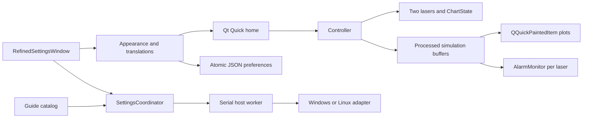

# Nexatom v1.7 — operator and development guide

Updated 30 September 2026. Application **1.7.0**; About deliberately reports
firmware **V1.6.0**. Use this folder as the next development base. Earlier version
folders are unchanged. No ZIP is required.

## Run

Windows: double-click **[Start Nexatom v1.7.cmd](Start%20Nexatom%20v1.7.cmd)**.
It opens fullscreen without a desktop title bar. Python/Qt are bundled; no pip
command is needed. Keep `runtime`, `packages`, `assets` and source folders together.
`Start Fullscreen v1.7.cmd` is equivalent. Startup failures show a message and
write `logs/startup.log`.

For desktop development:

```powershell
.\runtime\python.exe main.py --windowed --skip-boot
```

For 64-bit Raspberry Pi OS with a desktop session:

```bash
bash run.sh
```

The first Pi run installs missing dependencies and may need internet and sudo.
Subsequent launches reuse `.venv`. The Windows runtime cannot run on ARM.
Linux remains pinned to PySide6-Essentials 6.8.0.2; bundled Windows uses Python
3.13 / PySide6 6.11.2. Physical Pi acceptance testing is still required.

For a provisioned Yocto/Weston image:

```bash
QT_QPA_PLATFORM=wayland python3 main.py
```

Supply native Python, PySide6/Qt Quick/Qt Widgets and the Wayland plugin in the
image. Run as the graphical-session user with its `XDG_RUNTIME_DIR` and
`WAYLAND_DISPLAY`. The Debian setup script does not provision Yocto.
Fullscreen is the default; `--fullscreen` remains a compatible explicit alias.

## Changes in this refinement

| Request | Implementation |
|---|---|
| Preserve home | Same four parameter tiles, graphs and side controls; dark background `#111111` |
| Symmetric labels | Left graph label group aligns left; right group mirrors it |
| Active controls | Home retains white `#D9D9D9` active surfaces and unfilled inactive buttons |
| Signals controls | Accent-filled segmented choices and capsule visibility switches |
| Reference sliders | Wide rectangular value tiles, bordered tracks and current accent |
| Hardware slider jitter | One write on release; preview stays until readback, avoiding an old-value flash |
| Palette | All 15 supplied colors, including Black and White; contrasting accent text |
| Typography | Shared Roboto default, 14/16/18/24/28/36/46 scale; large readouts retained |
| Dropdowns | Anchored, touch-scrollable lists; all colors and installed fonts are reachable |
| Laser configuration | Single table with Parameter / Laser 1 / Laser 2 headings; inline numeric input |
| Alarms | More → Alarms; thresholds, evaluation, acknowledgment, status and scrollable event history |
| Numpad | Original geometry, contrasting number keys and distinct function keys; minus is a line glyph |
| Guide | 77 steps through real surfaces, dimmed surroundings and focused controls |
| Tooltips | 850 ms hold opens a rounded pointer card without activating the control |
| Not set | Muted “Not set” remains an unassigned shortcut |
| Languages | English, French, German, Spanish, Italian and Portuguese |
| Launch | Both Windows shortcuts open fullscreen without title/minimise/maximise controls |

The inherited More ring uses the older 220 ms OutCubic reveal. Closing reverses
it before navigation; cached reveal geometry leaves acquisition running. Search
and history stay centered together at the top. The custom keyboard is 1040 × 456
with 36 px bottom clearance. Backspace holds for 650 ms clear search/numeric input;
a short press deletes one character.

Palette: Red `#FF453A`, Orange `#FF9F0A`, Yellow `#FFD60A`, Green `#32D74B`,
Mint `#66D4CF`, Teal `#6AC4DC`, Cyan `#5AC8F5`, Blue `#0A84FF`, Indigo `#5E5CE6`,
Purple `#BF5AF2`, Pink `#FF375F`, Brown `#AC8E68`, Gray `#98989D`, Black `#000000`,
White `#FFFFFF`. Trace and channel identity colors remain independent preferences.

## Operator navigation

Wheel order: **Display → Function → Control → System → Storage → Help → Upgrade →
About**. Touch inertia, cyclic scrolling and tap-to-center are retained.

| Section | Behavior |
|---|---|
| Display | Real brightness/contrast, accent, light/dark, reported resolution/refresh modes, UI density |
| Function | Adjacent laser controls for baseline, bandwidth, samples, X/Y limits, trace/channel colors and width |
| Control | Explicit reserved preview for later external-control routing |
| System | Host clock, language, fonts, text size, side captions, idle power, runtime info, resets and guide |
| Storage | Actual disk use, settings JSON export, two-channel CSV capture, clear search history |
| Help | Graphs, Analysis, Parameters, System and Storage; sliding, scrollable documents |
| Upgrade | Explicit preview; no firmware download or installation |
| About | Requested identity fields and supplied QR |

About lists Model `Nexatom-DLC-Pro-2000`, Firmware `V1.6.0`, Organization
`Nexatom Research & Instruments`, Serial Number `NA-202609-01`, in that order.

### Home and chart interactions

- Channel switch changes only that half. Both halves can show the same laser;
  its values and chart configuration remain synchronized.
- Tap a module/field label to choose TC/CC/PC and a parameter. Tap a number to
  edit. Validated values apply; red X or outside tap cancels. Arrows move the caret.
- Lock blocks pan, zoom and rearranging without stopping live samples.
- Emission raises/lowers traces smoothly to zero. An idle laser's graph, status
  and other buttons dim; parameter tiles and emission remain readable.
- Stabilise reduces simulated noise. Pan, pinch/wheel zoom and double-tap reset
  work when unlocked. View bounds keep data reachable.
- Hold a plot for 550 ms: drag vertically within its half to swap signals, or
  across the divider to swap laser panels. Locked destinations reject the swap;
  an outside drop cancels.
- Tap Spectroscopy/Error for Signals. Combined overlays traces with visibility
  switches. Split assigns upper/lower placement. Only the bottom plot shows X ticks.
- Y axis slides in with independent Main/Error V/div and position, plus/minus,
  numeric editing, a 20:80–80:20 height ratio and Restore defaults.
- Fullscreen shares the same laser/chart state and label controls. X ticks use
  at most two decimals; the graph pair always shares its X domain.

### Function table and signal source

Each laser independently owns baseline, bandwidth, point count, limits, trace
color, channel color and line width. **Sampling rate is shared**: either column
updates the single acquisition timer and both displayed values.

| Setting | Effect / limits |
|---|---|
| Sampling | 5/10/20/30/60 nominal frame updates per second |
| Points | 256/512/1001/2001/4001 samples per laser frame |
| X limits | Span 0.4–80 V, shared by spectroscopy and error |
| Y limits | Independent main/error bounds, span 0.04–400 V |
| Numeric limits | Finite −1000…1000 V; unusable/inverted spans rejected |
| Baseline | Captures raw-frame median; emission must be settled; Reset removes it |
| Auto bandwidth | Temporal low-pass cutoff `min(8 Hz, rate × 0.2)` |
| Stabilise | Separate 0.24-second smoothing filter |
| Line width | 1–4 px; error stays dashed |

**The laser source is a visual simulator.** No physical ADC, laser driver or servo
loop is connected. Settings change actual simulation buffers and rendering.
The Qt timer is not a hardware acquisition clock. Both lasers have distinct
peaks/noise; emission reaches zero even when baseline subtraction is active.

### Alarms

More → Alarms monitors processed samples for the selected laser. Spectroscopy
uses maximum voltage; error uses maximum absolute voltage, so its threshold cannot
be negative. Evaluation runs at up to 10 Hz with a 250 ms breach dwell and 2%
release margin to reduce chatter. Enable and thresholds persist per laser.

A breach records a timestamped event and shows a home alarm banner; tap it to
open Alarms. Acknowledge marks the active condition without clearing it. Recovery
records another event. Emission off or disabled monitoring suspends evaluation.
The latest 50 events are held in memory for this app session. Clear history removes
events, not thresholds. These trace alarms are not physical laser interlocks.

### Guide, search and localization

The 77-step guide covers both sides, modules/fields/numpad, Signals/axes/visibility,
fullscreen, More/alarms, every settings row, Help topics, keyboard and history.
It advances every nine seconds while playing. Previous/Next/Pause/Skip remain
available. It sends no host commands, and chart modes used for demonstrations
are restored when the guide ends.

Tooltips use the supplied rounded-card/pointer design. Backspace keeps its separate
hold-to-clear gesture; plots keep long-press dragging. Search suggestions and caret
editing work with the custom keyboard. History stores eight distinct non-empty
queries on submit/dismiss and survives restart. The history button opens that list
with Clear; it is not a second input mode.

French retains its Help catalog. German, Spanish, Italian and Portuguese have real
interface-control translations; untranslated guide/Help prose, technical messages
and host errors fall back to English. Units/identifiers are preserved. Installed
fonts are selectable. UI density and text scale each range 90–120%, without changing
OS DPI. The 1600 × 720 design canvas fits the display with its aspect ratio preserved.

## Host integration and persistence

| Operation | Windows | Linux / Pi |
|---|---|---|
| Brightness | DXVA2 DDC/CI; internal-panel WMI fallback | sysfs backlight; `ddcutil` fallback |
| Contrast | DXVA2 DDC/CI if supported | `ddcutil` VCP 12 if supported |
| Resolution/refresh | Enumerate, test, apply and read back Win32 modes | `wlr-randr` on compatible Wayland; `xrandr` on native X11 |
| Clock | `SetLocalTime` | `timedatectl set-time` |
| Sleep/shutdown | `SetSuspendState` / `shutdown.exe` | `systemctl suspend` / `systemctl poweroff` |

Host writes run serially on a worker. A slider previews locally, writes once on
release and keeps the preview until readback. Failure restores the accepted value
and reports the reason. No opacity layer imitates hardware brightness/contrast.
The adapters target the primary Windows monitor or first supported Linux output/
backlight; there is no multi-monitor selector.

Only reported modes are offered. Mode changes have a 15-second Keep/Revert
countdown; timeout, closing Settings or app shutdown attempts restoration. Keep
applies for the OS session, without rewriting persistent compositor configuration.
Weston is not assumed to implement wlroots output management. Unsupported controls
report the reason. DSI panels may lack contrast. Driver/DDC and clock/power
permissions must be provisioned for the graphical-session user.

Idle power defaults to Never. Optional sleep/shutdown follows 1/5/15/30/60 minutes
of app inactivity with a cancellable 30-second countdown. These are real host
commands. Restore defaults preserves search history; Factory reset also clears
history and the laser session. Both require in-app confirmation and do not flash
eMMC, delete exports or reset OS display settings.

`data/settings.json` stores preferences/history using temporary-file write and
atomic replacement. Invalid saved alarm limits fall back to valid defaults.
Timestamped JSON/CSV exports go into `exports/`. CSV columns are
`laser,x_V,spectroscopy_V,error_V`. Alarm events and graph arrangement remain
session state, not saved hardware configuration.

## Architecture and source map



| Source | Responsibility |
|---|---|
| `main.py`, `desktop_launcher.py` | Lifecycle, fonts, fullscreen and visible startup errors |
| `controller/bridge.py` | QML API, live state, timer and alarm integration |
| `controller/model.py`, `charts.py` | Two lasers, parameters, axes/layout validation |
| `controller/simulation.py`, `plot.py` | Samples, filtering and graph rendering/gestures |
| `controller/alarms.py` | Dwell/hysteresis, acknowledgement and bounded history |
| `qml/Main.qml`, `ChannelPane.qml` | Composition, overlay order and independent panes |
| `qml/SignalsPanel.qml`, `ReferenceSlider.qml`, `ToggleChoice.qml` | Chart controls and reference widgets |
| `qml/AlarmPanel.qml`, `NumberPad.qml` | Alarm scrolling/editing and numeric input |
| `qml/TooltipOverlay.qml`, `TourOverlay.qml` | Home touch help and guide focus masks |
| `settings_ui/integration.py` | Attach/return Settings to QML home |
| `settings_ui/refined.py` | Two-laser table, dropdowns, inline values, stable sliders and guide |
| `settings_ui/operational.py` | Settings pages, routes, editors and Help |
| `settings_ui/window.py`, `motion.py`, `keyboard.py` | Retained wheel, gestures and keyboard |
| `settings_ui/controls.py`, `drawing.py`, `layout.py` | Typography, painter controls and geometry |
| `settings_ui/preferences.py`, `model.py` | Shared theme, persistence and search |
| `settings_ui/coordinator.py`, `tour.py`, `tooltips.py` | Host jobs, rollback and guide/help targets |
| `settings_ui/locales.py`, `translations.py`, `help_content.py` | Language catalogs and local documentation |
| `device/` | Native OS adapters, independent of the UI |

UI/model changes run on the Qt main thread. Host calls use the coordinator's
serial worker and return readback/errors to the UI. `create_application(device=...)`
injects an isolated adapter for safe tests. For future versions, extend table rows,
defaults, search, guide, translations and Help together; keep OS commands in
`device/` and tests free from real clock/power changes.

## Validation

```powershell
.\runtime\python.exe tests\verify_refinements.py
.\runtime\python.exe tests\verify_v17.py
.\runtime\python.exe tests\verify_touch.py
.\runtime\python.exe tests\verify_charts.py
.\runtime\python.exe tests\verify_linux_device.py
.\runtime\python.exe tests\verify_desktop.py
```

The suites exercise real Qt event dispatch with an isolated host adapter: independent
columns, numeric validation/cancel, palette access, delayed readback, touch deduplication,
hold-to-clear, tooltips, alarm evaluation and all guide routes. Retained suites cover
chart swaps, lock, shared axes, fullscreen, fades and Linux adapter contracts.
Reports are in `tests/*validation.json`; new screenshots are in
`tests/refinement-screenshots/`. Both real Windows launchers are also checked for
visible fullscreen startup and live acquisition after boot.

No physical Pi/CM5, Yocto compositor, alternative monitor mode, clock/power action
or laser hardware has been tested in this refinement. These remain deployment
acceptance checks. Control/Upgrade remain the requested previews. Earlier reports
are historical; rerun the commands after further changes. Offscreen Qt may emit
benign raise-window and PinchArea override warnings.
