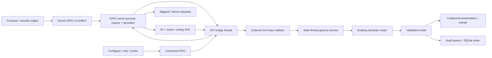
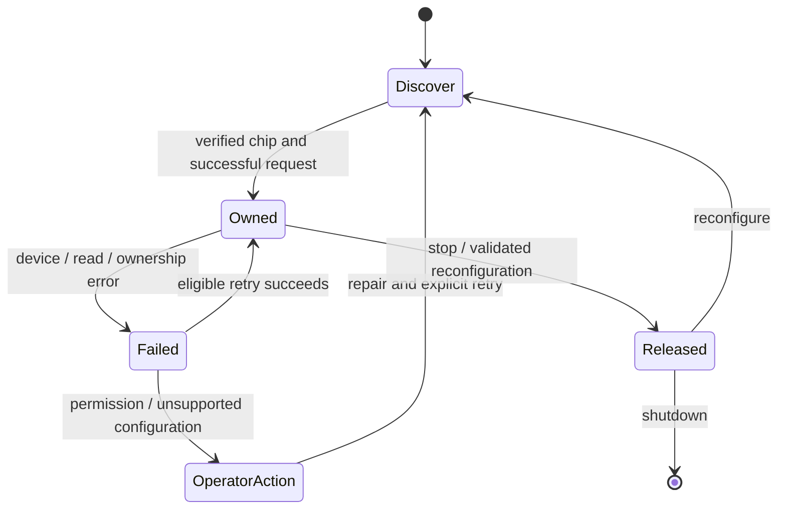

# v1.17 hardware input architecture

## Proven defects and investigation limits

Executable regressions against untouched v1.16 reproduced three failures: two debounced panel presses delivered in one batch produced one action; a delayed long push became a short push; a standalone push followed by a separate tilt was suppressed. The old service reasoned from the batch's final snapshot, used delivery time for holds, and treated any tilt in the batch as part of every push. The new service replays intermediate states in capture-time order.

Normal v1.16 contact acquisition used polling. A complete press/release while the reader was descheduled could be invisible. The new driver-contract test replays a buffered 40 ms press after the gesture ends and verifies both transitions. Supported contacts and encoders now use kernel edge events.

Full-app profiling exposed repeated QML tree searches, hidden parameter-page refreshes, duplicated plot work and synchronous audit writes in the input handler. A database-lock regression reproduced a **5.6-second** blocked command. The new audit writer has its own SQLite connection off the GUI thread. Scene caching, visible-page updates and presentation batching address the measured frontend work.

A 2,000-command development stress test exposed an IPC deadlock: both endpoints could block sending while replies needed reading. One in-flight command with continuous event draining fixes that cycle. The regression checks every acknowledgement once, in FIFO order, while inputs are active.

No physical Pi exception trace was available. The original intermittent runtime error cannot honestly be attributed to a specific kernel fault or descriptor leak from the description alone. Tested software causes are distinguished from physical qualification still required.

## Ownership and data flow

Only the child opens/releases line requests, reads values and drains edges. The bridge is the sole parent-side IPC sender and independently reads replies while Qt is busy. Only the Qt main thread mutates application state/widgets. Locks protect shared deques, pending commands and measurements. Decoder/configuration state is private to the owner.

Each enabled knob owns one seven-line request; each panel contact owns one request: eight requests / 26 unique GPIOs for stock wiring. Kernel acquisition is the atomic ownership arbiter. There is no race-prone `line.used` pre-check. Partial contention disables only the affected control.

The kernel keeps lines exclusive until their request descriptor closes; closing a chip inventory handle does not release a separate request. See [kernel request lifecycle](https://docs.kernel.org/userspace-api/gpio/gpio-v2-get-line-ioctl.html) and [libgpiod request API](https://libgpiod.readthedocs.io/en/v2.3/python_line_request.html). No request is shared between application threads.

## Queue, priority and timing policies

| Layer | Policy |
|---|---|
| Kernel | Request a 4,096-event buffer per request. Check global sequence numbers from the first event, including 32-bit wrap. Actual buffer allocation is kernel-dependent. |
| Owner | Selectable GPIO FDs plus command pipe; timestamped batches. Bounded per-request work gives commands a scheduling point. No arbitrary sleeps. |
| Debounce | Stable-state debounce using capture time: knob contacts default 8 ms, emission/shortcut 25 ms, system lock 30 ms. Shorter instability is intentionally filtered. |
| Encoder | Quadrature state table, configured 1/2/4 transitions per detent. Reverse edges cancel partial bounce; illegal jumps increment an invalid-transition counter. No timed encoder debounce. |
| Input FIFO | No event eviction or last-value-only contact replacement. Press/release and reversals remain distinct. |
| Rotation batching | Add only adjacent same-knob, same-direction, same-epoch deltas. Preserve their sum and oldest timestamp; never cross a contact, another control or reversal. |
| Ordering | Capture-time order; lock assertion wins a timestamp tie. No arbitrary input discard to manufacture low latency. |
| GUI scheduling | Idle timer 4 ms; backlog timer 1 ms. Work slices 8 ms normally, 32 ms above 24 queued batches, 64 ms above 100, then yield to Qt. Actual cadence depends on scheduling. |
| Presentation | Every model delta is processed. Repeated numeric refreshes are combined to roughly 30 Hz. Under input pressure graph redraws defer while acquisition continues. |
| Commands | FIFO, IDs, one in flight. ACK completion lane avoids false timeout behind input presentation. |
| Timeout | Report a dispatched command without ACK after 5 seconds; never blindly replay it. Queue wait and driver wait are measured separately. |
| Overload | Report backlog above 2,000 batches and retain events. RAM is finite; queues buffer bursts, not infinite sustained input. |

Kernel buffers cannot reconstruct lost edges. Sequence numbers reveal overflow: [GPIO v2 event-read semantics](https://docs.kernel.org/userspace-api/gpio/gpio-v2-line-event-read.html). On a gap, report the fault, count missing edges, resynchronize only that control and require release to re-arm. Never invent steps.

Startup, calibration and reconfiguration deliberately inhibit ordinary commands until a configured/calibrated control is released and quiet for 250 ms. An already-held control must not accidentally act. Shared joystick-direction plus push contacts remain supported. Missing lock samples never imply unlock.

ENXIO on contact interrupts permits an explicitly **degraded** contact-only 4 ms polling fallback; encoders still require interrupts. Polling cannot guarantee a complete pulse between reads will be seen. Qualify interrupt support before relying on that mode.

## Recovery and shutdown

Transient EBUSY, ENODEV, ENOENT, EIO and ENXIO use per-control retry deadlines: 0.25, 0.5, 1, 2, 4, then at most 8 seconds. Healthy requests stay owned. If all requests disappear and selection is automatic, discovery can find a re-enumerated chip. Permissions, missing/incompatible libraries and invalid configuration require correction.

Validate new configuration before releasing existing requests. Reconfiguration uses a new epoch and clears gesture state. Assign request ownership before operations that can fail; failed initialization unregisters/releases the request. Cleanup attempts every request, then closes selector and IPC resources. Recovery creates a replacement only after the old owner stops.

Stop wakes the selector, releases resources and joins the process/bridge. A hung process has a bounded graceful window followed by termination as a shutdown-only fallback. If the bridge cannot stop, replacement is refused. Unexpected owner exit is surfaced and can reconnect without restarting the UI.

The audit writer is a separate storage concern, not a redundant hardware queue. Its in-memory view retains at most 10,000 entries, as before. Normal shutdown flushes writes. Sudden power loss may lose uncommitted entries. Storage failures are explicit; memory export remains usable. This is not a power-loss-durable safety recorder.

## Driver / firmware boundary

The GPIO interface is **input-only**. Existing values feed a simulator; no DAC/ADC/laser transport is fabricated. A driver ACK means userspace/libgpiod work completed, not MCU/laser acceptance. Physical hardware acknowledgement latency is unavailable.

Kernel buffering, the owner and GUI ingress have distinct roles. No MCU queue is added without an MCU protocol. Future output transports must define identity, idempotency, ACK and timeout at their transport owner. USB update and Yocto packaging remain outside v1.17.

## Stock wiring (BCM numbers, unchanged)

| Control | Connections |
|---|---|
| Knob 1, top left | C 2, D 3, encoder A 4, A 17, push 27, encoder B 22, B 10 |
| Knob 2, bottom left | C 14, B 15, encoder B 18, push 23, A 24, encoder A 25, D 8 |
| Knob 3 | Unused |
| Knob 4, bottom right | B 26, encoder B 19, C 13, D 6, encoder A 5, A 0, push 21 |
| System lock | 20 |
| Right / left emission | 12 / 1 |
| Right / left shortcut | 7 / 16 |

Pull-ups and stored polarity/calibration are retained. Unconnected power-on readings are not a global polarity rule. A second GPIO utility requesting the same lines should receive an ownership error while this app runs.

Executable contracts: `test_realtime.py`, `test_owner.py`, `test_pipeline.py`, `test_mailbox.py`, `test_journal_latency.py`. Target-device acceptance: [BENCHMARK.md](BENCHMARK.md).
