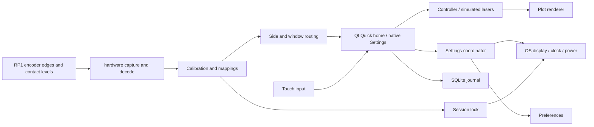

# Nexatom interface

Current working copy: **fixed**, based on the preserved `../app` (v1.8).
Updated 5 October 2026. Application version remains 1.8.0; About still reports
firmware V1.6.0. Earlier application folders are untouched.

## Run

**Windows:** double-click [start.cmd](start.cmd). Python and Qt are included.
The application opens fullscreen after its three-second boot animation.

**Raspberry Pi OS Desktop, 64-bit:** copy this folder to the Pi or a USB drive and
open [start.desktop](start.desktop). Choose Execute / Allow Launching if the file
manager asks. The equivalent single command, from this folder, is:

```bash
bash start.sh
```

Setup copies the app to **~/nexatom**, installs OS/Python dependencies, configures
GPIO/display access, creates shortcuts, enables desktop login and registers app
startup. Windows `runtime` and `packages` are excluded from the Pi installation.
Existing saved calibration and settings in ~/nexatom are retained.
First setup needs internet access. Passwordless sudo is used when already permitted;
otherwise the OS authentication dialog appears. The app runs as the normal user.

Select **Restart now** when offered to apply boot pin changes. The next desktop
session launches the app automatically. **Settings > System Settings > Startup**
contains Start on login and Repair setup / dependencies. Disabling app startup
leaves desktop autologin enabled. Restart the app after repair.

No manual kernel edits or pip commands are needed on the supported OS. The installer
uses APT and LightDM/labwc/XDG hooks; it does not provision Yocto or Pi OS Lite.
It disables header I2C/SPI/UART functions conflicting with the supplied wiring and
backs up boot files as config.txt.previous and cmdline.txt.previous. Other desktop
startup commands are preserved; a process lock prevents duplicate app launches.

Close the standalone RKJXT demo before using this app. Other owners of GPIO pins
are reported; setup does not kill unrelated applications or remove custom overlays.

## Repairs in this copy

- Home uses one mirrored geometry rule for both sides: 88 px side buttons with
  equal 9 px gaps, equal sidebar clearance, header positions, parameter selectors
  and chart-label offsets. Chart frames are 656 px wide, at x=122 and x=822.
  The center divider is centered at x=800. Drag skeletons use those same bounds.
- Both right-side plots put their Y readings on the right; left plots retain
  their left Y readings. The shared X axis remains ascending left-to-right and
  is drawn only below the lower trace. Combined-mode secondary axes also mirror.
- More uses the actual v1.6 fixed-sector implementation: 800 ms expansion and
  reverse closing, cached sector artwork, and a cancel button centered on More.
  The restored origin is y=556. Alarms, Settings, Logs and Diagnostics are retained.
- Lock and Stabilise are disabled immediately when emission is off. Controller
  guards also reject knob/shortcut attempts. Re-enabling emission restores access;
  saved lock/stabilise states are retained. Off plots reject pan/zoom gestures.
- Signals uses neutral grey surfaces and active #D9D9D9 choices/toggles. The
  selected accent is no longer used as a fill for every selected chart control.
- Notifications never exceed two visible cards. Overflow does not become a long
  parade of stale routine messages. Automatic expiry still blurs/fades; Close is
  immediate. Clearing the history and per-notice confirmation still work.
- Settings remains a persistent fullscreen surface over Home. Home is not hidden
  and recreated on every visit. A requested section is prepared before showing;
  stale subpage/wheel transitions are stopped at entry. Touch scrolling inside
  Settings remains animated. Returning preserves the current home/chart state.
- GPIO acquisition separates encoder interrupts from contact reads and isolates
  request failures. See the acquisition notes below. Operator errors are short;
  detailed exceptions remain in the diagnostic files.
- Pi startup checks current GPIO read/write permissions even when the dependency
  marker exists, repairing access through the existing setup flow. A second app
  launch reports that the existing instance must be closed rather than silently
  returning a blank terminal.

The original **app** and all earlier versions remain unchanged. No ZIP is needed.

## Retained features

| Area | Implemented behavior |
| --- | --- |
| Lock screen | Lock now, shutdown timeout including Never, and digital-lock calibration. Hold Unlock for one second to resume a manual lock. An active physical lock cannot be bypassed by touch. |
| Trace settings | Independent Main/Error colors, widths and Solid/Dashed/Dotted strokes for both lasers. Existing limits and axes remain live. |
| More | Alarms, Settings, Logs, Diagnostics. Display stays inside Settings. Restored 800 ms expand/retract fan, moved slightly down. Fixed v1.6 sectors expand/retract; knob navigation changes the highlighted sector without rotating the layout. |
| Knob menu operation | Push opens/closes; rotation and up/down navigate; left/right opens the highlighted option. Touch selects a sector directly. Side ownership is preserved. |
| Logs | Persistent live/paused monitor, severity filter, scrolling, consent before clear, CSV/Markdown export. Timestamp, description, outcome and level. |
| Chart labels | Right label button at the outer right; background opacity 55%. X labels stay out of the Y-label gutter. |
| Notifications | Maximum two visible cards, including fading cards. Newest above older, independent timers, 650 ms blur/fade expiry and immediate manual close. Routine bursts retain only the two latest waiting previews; all actions remain in History/Logs. Consent/critical notices are preserved. Small/Medium/Large sizes remain. |
| Sliders | Active-white thumbs with three vertical grip lines, independent of accent color. |
| Keyboard | Earlier orange press feedback restored; suggestions, real history, caret/selection and hold-to-clear retained. |
| Guide | Combined mode is a preview, not a chart-state write. Prior fullscreen, ranges, settings page, scroll and search are restored. Theme and operational chart state are preserved. |
| Deployment/debugging | Short launch names, automatic Pi setup/startup, retry icons, persistent Python/Qt/handled-error reports. |

The existing two-laser home layout, adaptive corner colors, CC/TC/PC selectors,
numeric editor, shared X scale, graph lock, pinch/wheel zoom, bounded pan, drag swaps,
height ratio, emission confirmation, alarms, themes and settings wheel remain.
Laser acquisition and parameter effects are still the requested visual simulation.
GPIO inputs and supported OS display/clock/power actions are real. Upgrade remains
the previously requested preview.

## Digital lock wiring

This copy assumes the existing GPIO20 lock is a **dry contact/key switch**.
All GPIO numbers are BCM numbers, not connector positions.

| Contact | Connect to |
| --- | --- |
| Common / isolated relay COM | Pi GND |
| Contact closed in the locked position | GPIO20 |
| Power to a mechanical contact | None |

On a standard Raspberry Pi 40-pin header, GPIO20 is physical pin 38 and pin 39
is GND. Verify your custom CM5 carrier's connector labels. The app requests an
input pull-up and uses 30 ms debounce: closed to GND locks; open unlocks.
Change pin/polarity or calibrate under **Control Settings > Buttons & lock > System lock**.

For a powered digital-lock module, use its **isolated dry-contact relay output**
as the switch above, with a separate supply specified by its manufacturer. Do not
connect a 5 V/12 V/24 V status output directly to GPIO. A logic-output module needs
a verified compatible interface or isolation; its model/output specification is
required to choose that interface. Standard Raspberry Pi GPIO inputs allow at most
3.3 V; a custom CM5 carrier may select a different GPIO reference.
[Raspberry Pi GPIO guidance](https://pip-assets.raspberrypi.com/categories/685-whitepapers-app-notes/documents/RP-006553-WP/A-history-of-GPIO-usage-on-Raspberry-Pi-devices-and-current-best-practices),
[CM5 datasheet](https://datasheets.raspberrypi.com/cm5/cm5-datasheet.pdf).

Locking captures and blurs the current screen and blocks touch, keys and knobs.
Acquisition continues. Unlock before expiry to cancel pending shutdown and resume.
The default timeout is 60 seconds; Never disables it. Expiry requests actual OS
shutdown. Failures are shown and logged while the interface stays locked. This is
an application interface lock, not an authenticated OS lock or a hardware laser interlock.

## Control wiring

| Signal | Knob 1: top left | Knob 2: bottom left | Knob 4: bottom right |
| --- | ---: | ---: | ---: |
| A | 17 | 24 | 0 |
| B | 10 | 15 | 26 |
| C | 2 | 14 | 13 |
| D | 3 | 8 | 6 |
| Encoder A | 4 | 25 | 5 |
| Encoder B | 22 | 18 | 19 |
| Push | 27 | 23 | 21 |
| Common | GND | GND | GND |

Knob 3 remains disabled. Button 1: GPIO12, right emission. Button 2: GPIO1,
left emission. Button 3: GPIO7, right shortcut. Button 4: GPIO16, left shortcut.
Each button closes its GPIO to GND. GPIO8 remains Knob 2 D.

Calibrate each knob in Control Settings before shortcuts operate. Capture released
state, center-only push, then Up/Right/Down/Left, releasing between gestures. Direction
plus push contact is supported. Check the encoder and save. Unconnected pin readings
do not determine polarity: the app requests pull-ups and uses saved calibration.
Existing stock wiring migrates while retaining valid calibration/mappings.

## GPIO acquisition and recovery

`hardware/gpio.py` owns the input request in a worker thread. It selects the unique
RP1 chip; when its label changes, it can verify the BCM GPIO line names instead
of assuming gpiochip0. An explicit chip in `data/controls.json` still takes priority.
All lines are inputs with pull-ups and raw electrical polarity. It never drives
an output or takes a line away from a kernel driver/another application.

Encoder A/B use BOTH-edge capture with a 4096-event request buffer. The worker
polls joystick/push/panel contact levels on a 4 ms wait cycle; existing software
debounce and shared direction+push decoding apply. UI snapshots are published at
up to 60 Hz. A busy control is excluded, with working controls remaining live.
If the combined request fails, requests are isolated per knob/contact. A readable
button without interrupt support therefore does not disable all encoders. A knob
is decoded only when its complete configured group can be acquired.

The worker watches busy owners and reconnects after release. Full connection
failures use bounded automatic retry. Non-busy per-control request rejections can
be retried with **Retry GPIO** after their cause is corrected. Missing lock samples
do not unlock a session that is already locked. Retrying does not erase calibration.

This repair addresses reproduced software failure paths, not a confirmed diagnosis
of this particular Pi: SSH reached 192.168.1.157, but authentication prevented
reading its exact GPIO error. Tests inject readable contacts, unsupported requests,
busy pins, changing owners and queued encoder edges. The physical wiring/pulses,
boot setup and real GPIO ownership still need acceptance on the Pi.

Why the request boundary matters: a Linux GPIO line request owns its requested
lines exclusively and can fail on a busy line or unsupported interrupt setup.
[Linux GPIO v2 request documentation](https://www.kernel.org/doc/html/latest/userspace-api/gpio/gpio-v2-get-line-ioctl.html).
The Python API supports different settings for groups of lines within a request.
[libgpiod Python request API](https://libgpiod.readthedocs.io/en/v2.3/python_misc.html).

## User logs and error reports

More > Logs and Settings > Logs open the same journal. It records parameter edits,
graph actions, settings changes, GPIO status/configuration, locks, confirmations and
reported device failures. Continuous gestures are coalesced after settling. It does
not log every ADC sample or touch coordinate. Muting routine notices keeps logging active.

- Outcomes: Passed, Failed, Requested, Cancelled. Requested means pending approval/action.
- Severity: default, warning, critical. Informational events use Passed.
- Local timestamps include milliseconds; storage/export also includes timezone.
- Up to **10,000** newest entries are retained in `data/events.db` (SQLite WAL).
- Pause freezes the view, not recording. New events preserve the reading position while scrolled back.
- Export writes **exports/logs.csv** and **exports/logs.md**, replacing these two previous exports. Copy them elsewhere to retain a particular export. Spreadsheet formula text is escaped in CSV.
- Clear requires confirmation and leaves a clearing audit record. It never clears error files.

| File | Contents |
| --- | --- |
| logs/errors.txt | Unhandled Python/thread exceptions and Qt warnings/errors; runtime context and available tracebacks |
| logs/bugs.txt | Handled application/device failures |
| logs/fatal.txt | Fatal Python stack dumps where the runtime can produce one |
| logs/controls.log | GPIO connection, pin ownership, calibration and delivery diagnostics |
| logs/setup.txt | Pi installation and launch output |
| logs/startup.txt | Windows launch output and startup errors |

Errors/bugs rotate at 2 MB with three backups; controls at 1 MB with two. Fatal
traces rotate on the next startup after 2 MB. Reports stay local. Retain them with
reproduction steps when debugging. Power loss, process termination and undetected
logic bugs cannot be guaranteed to produce reports. The journal is an operational
record, not a tamper-proof compliance audit.

## Structure



| Path | Responsibility |
| --- | --- |
| main.py | Qt composition, service connections, lifecycle |
| controller/ | Laser state, simulated signals, alarms, bounds, gestures, plotting |
| qml/ | Home, graph panels, More fan, numpad, sliders, home notifications |
| settings_ui/ | Settings wheel/table, keyboard/history, tooltips and guide |
| settings_ui/console.py | Logs, lock/startup pages, notification sizing |
| hardware/ | Chip discovery, buffered encoder edges, polled contacts, partial request recovery, debounce, calibration and mappings |
| interaction/ | Routing, session lock, notifications, icons, journal and fault capture |
| device/ | Windows/Linux display and OS capability/write/readback interfaces |
| start.sh / setup.sh | Normal-user launcher and administrator-only provisioning |
| install.py / boot.py / startup.py | Data-preserving staging, idempotent boot changes, session startup registration |
| start.cmd / launch.py | Included Windows runtime and visible launch errors |
| data/ | Persistent settings, calibration/history and journal; retain during upgrades |

Launch files use short alphabetic names. Inherited imports and third-party names
are preserved for compatibility. Qt/Python licenses remain in their packages;
Roboto's license is in assets. Earlier implementation history is in the preserved
[v1.8 README](../Versions/mock1.8-pyside6/README.md).

## Validation

The actual Windows launcher was verified fullscreen, visible and acquiring after
boot. A native Windows handoff check opened four Settings sections and confirmed
that their first paint had the correct page, geometry remained fullscreen, and
Home was never unmapped. The 1600 x 720 design scales to the connected screen.

Current automated checks include 54 unit tests; mirrored geometry and emission-off
touch/knob guards; GPIO failure isolation/contact/encoder contracts; two-card
notification lifetimes/consent; the restored fan in both directions; native touch
pan/pinch/drag; chart controls; and the existing guide/settings flows. Power tests
use a recording adapter, never actual host shutdown. Generated screenshots are
in [chart-screenshots](tests/chart-screenshots),
[interaction-update-screenshots](tests/interaction-update-screenshots) and
[handoff](tests/handoff). Older test scripts remain for future development.

```powershell
.\runtime\python.exe -m unittest discover -s tests -p "test_*.py"
.\runtime\python.exe tests\fixes.py
.\runtime\python.exe tests\console.py
.\runtime\python.exe tests\regress.py
.\runtime\python.exe tests\verify_refinements.py
.\runtime\python.exe tests\verify_charts.py
.\runtime\python.exe tests\verify_control_update.py
.\runtime\python.exe tests\verify_interaction_update.py
.\runtime\python.exe tests\verify_zoom_paths.py
.\runtime\python.exe tests\verify_linux_device.py
.\runtime\python.exe tests\handoff.py
.\runtime\python.exe tests\verify_desktop.py
```

Run GUI checks serially. Installer tests use temporary files, never the host boot
configuration; Bash syntax checks pass. **Physical Pi installation, cold boot, GPIO
edges and display/power behavior still require acceptance on your hardware.** They
were not physically tested from this PC. After setup/restart, verify autostart,
saved calibration and GPIO20 lock/release; select Never while checking the lock
if you do not want shutdown during the check.

Startup follows [Raspberry Pi's labwc guidance](https://www.raspberrypi.com/tutorials/how-to-use-a-raspberry-pi-in-kiosk-mode/)
and the [labwc configuration rules](https://labwc.github.io/labwc-config.5.html).