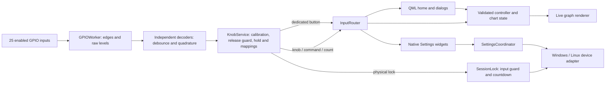

# Nexatom v1.8 — RKJXT control integration

Application **1.8.0**, based on `mock1.7-pyside6`. Updated 1 October 2026.
The original 1600 × 720 home layout, two lasers, chart tools, settings wheel and
saved appearance preferences are retained. Earlier version folders were not edited.
About still reports firmware **V1.6.0**, as requested.

## Start the application

**Windows:** double-click [Start Nexatom v1.8.cmd](Start%20Nexatom%20v1.8.cmd).
Python and Qt are included. The application opens fullscreen after its three-second
boot screen. `Start Fullscreen v1.8.cmd` is an equivalent launcher.
Keep the source, `assets`, `runtime` and `packages` folders together.

**Raspberry Pi OS Desktop, 64-bit:** copy this folder to a writable local folder,
open a terminal in that folder, and run this single command:

```bash
bash run.sh
```

The first run downloads and installs the Qt/GPIO/display dependencies, creates a
local Python environment, grants GPIO and display access, and adds **Nexatom v1.8**
to the desktop and application menu. It requests OS authentication through `pkexec`
where available. Later launches reuse the installation and need no pip commands.
Run as the normal desktop user; the application does not run as root. First setup
needs network access. Windows `runtime` and `packages` are not used on the Pi.
If the desktop asks whether to trust the generated shortcut, choose Allow Launching.

**Close the standalone RKJXT demo before starting GPIO control here.** It requests
the same pins. Its old launcher also installed an autostart entry; disable that
entry in your desktop session's startup applications if it keeps returning after
reboot. v1.8 reports the owning process/driver instead of taking pins from it.

**First use on the Pi:** More → Settings → Control Settings → Configure →
Calibrate directions and push. Calibrate Knobs 1, 2 and 4 separately. Touch is
needed for initial calibration; knob shortcuts are intentionally inactive until
that knob is calibrated.

Development launches:

```powershell
.\runtime\python.exe main.py --windowed --skip-boot
```

```bash
bash run.sh --windowed --skip-boot
# Repeat OS setup if permissions or display packages need repair:
bash run.sh --repair-setup
```

For a provisioned Yocto image, use its native Python, PySide6, Qt Quick/Widgets/SVG,
Wayland platform plugin and Python libgpiod v2. The Debian installer is for
Raspberry Pi OS, not Yocto:

```bash
QT_QPA_PLATFORM=wayland python3 main.py
```

Use the active graphical session's `WAYLAND_DISPLAY` and `XDG_RUNTIME_DIR`.

## What changed

| Area | v1.8 implementation |
|---|---|
| Home readouts | White values, labels, units, icons and dividers; pale Yellow/Mint/Teal/Cyan/White accents adapt all foreground elements together |
| CC / TC / PC | v1.4/v1.5 module chooser geometry and dark selected/unselected surfaces restored; light appearance still adapts |
| Graph gestures | One pinch handler per laser spans both plots; pinch takes over a long-press drag; linked X ranges, lock guard and wheel/knob zoom retained |
| Graph bounds | Existing overscroll and vertical trace-retention limits retained; knob pan/zoom use the same limits |
| Physical inputs | One input-only libgpiod request for 21 knob signals and 4 enabled panel inputs; three independent decoders for Knobs 1, 2 and 4; Knob 3 stays disabled |
| Calibration | Released-state capture, centre-only contact first, four directions with optional shared push, clockwise/anticlockwise verification and atomic save |
| Assignment | Per-knob target corner plus seven operation dropdowns; live parameter preview; separate shortcut/calibration resets |
| Navigation | Hold push for universal navigation; visible focus, modal-aware targets, dropdown scrolling, numeric digit stepping, Settings wheel/slider/keyboard control |
| Touch diagnostics | Corner taps, continuous trace, drag targets, solid-color inspection and honest pass/not-completed results |
| Display recovery | Failed capability detection can be retried; Retry display button; Pi installer includes DDC/I2C and permissions |
| Icons | Shared outline Control, Alarm, Knob, Calibration, Screen Check and Diagnostics glyphs; Alarms has its own bell |
| Help | 97-step guide, dedicated paused Knob guide, in-app Knob controls document, more explanatory tooltips |
| Data and diagnostics | Separate validated `controls.json`, rotating GPIO log, read-only `--list-gpio`, controls included in settings exports |

Existing emission/stabilisation, chart split/combined mode, independent Y scales,
20:80–80:20 ratio, drag swaps, alarms, search/history, numpad, themes and six-language
navigation remain available. New detailed knob instructions use English fallback
where a translation is not available. Upgrade remains the previously requested
preview. Laser signals and laser parameter effects remain a visual simulation;
the GPIO inputs and supported host display controls are real.

## v1.8 corrections - 30 September 2026

- Automatic corner foregrounds use one adaptive ink; the October update adds independent number and detail overrides. The original green
  is restored to **`#008622`**; other accent choices are unchanged.
- Pinch zoom now works with one finger on spectroscopy and the other on error,
  including when the first finger has already started the graph-move gesture.
  The shared gesture cancels that move without swapping signals. Both graphs
  keep the same X range. One-finger pan and long-press swaps remain available.
  Zoom requires an unlocked graph; touch pinch requires a multitouch screen.
- Calibration identifies the centre-only contact before learning directions.
  A direction plus centre is accepted as one tilt. Runtime decoding suppresses
  the accompanying push shortcut and long-push navigation, regardless of contact
  press/release order. Standalone centre presses still work normally.
- **Knob 3 is disabled; Knob 4 is wired and targets the bottom right.** Existing
  stock `controls.json` files migrate on startup (`wiring_revision: 2`). Knobs 1/2
  retain all saved settings. Old Knob 3 shortcuts/encoder resolution move to
  Knob 4, but its calibration resets because this is a replacement physical unit.
  A custom non-stock pin layout is preserved for explicit configuration.

For an existing Pi installation, copy the updated code into its v1.8 folder while
keeping its existing `data` directory, then run `bash run.sh`. The saved wiring
migrates automatically. Open **Control Settings > Knob 4 > Configure > Calibrate**.
Recalibrate Knobs 1/2 if their previous calibration was incomplete or incorrect.
No other version folder is changed.

The original repro commands were `tests/test_shared_contact.py` (calibration rejected
combined contacts; tilt fired hold-navigation) and `tests/verify_zoom_paths.py`
(cross-plot and held-finger pinch left the range unchanged). Both now pass against
the actual state machine and Qt touch paths. The fix uses Qt's documented
[targetless PinchHandler](https://doc.qt.io/qt-6/qml-qtquick-pinchhandler.html)
to change the data range without scaling the plot widget itself.

## Control update - 1 October 2026

This update remains **v1.8.0** in the same development folder. Keep the Pi's existing
`data` directory when replacing the application code: configuration migration adds
the new panel inputs without discarding saved knob calibration or shortcuts.

| Change | Implemented behavior |
|---|---|
| Lost rotation steps | Removed the 24-step dispatch limit; consecutive same-direction edges are batched without dropping steps or merging reversals. Cold focus navigation also consumes the complete batch. A replay of 320 valid encoder edges delivers all 160 decoded steps to the current readout. |
| Side ownership | Knobs 1/2 stay on the left home half; Knob 4 stays on the right. Rotation, push and Back continue to operate the active panel. Knob 3 remains blank and disabled. |
| Right edge | All five right-side buttons fit inside the 1600-pixel frame, with a seven-pixel outer margin. |
| More menu | Bottom-corner quarter-ring; 720 ms expansion and reverse closing; upright icons; infinite scrolling through five options; fixed filled `#D9D9D9` sector and caption card behind the ring. Touch dragging, neighbor-sector taps and knob rotation all work. |
| Emission confirmation | Touch uses slide-to-confirm. Knob rotation fills the track and push commits. A dedicated emission button opens the request; a second deliberate press after 500 ms confirms. The laser state changes only after confirmation. |
| Noise | Independent seeded broadband noise and correlated pickup on each laser, while retaining smooth emission fade, stabilisation and optional bandwidth filtering. These are simulated samples. |
| Themes | Six coordinated presets, with real application screenshots in [the offline gallery](previews/index.html). Separate corner-number and label/icon foreground settings. |
| Feedback | Compact normal, yellow-warning and red-critical notices, explicit consent callbacks, close buttons and a persistent 200-entry inbox. Continuous graph changes are announced once they settle. |
| Physical lock | GPIO20 captures and blurs the current screen, blocks touch/keyboard/knob commands and starts a real OS-shutdown countdown. Unlock cancels a pending request. |
| Calibration | Buttons & lock page supports pin, enable, polarity, debounce and release/press calibration. Duplicate GPIO ownership is rejected. |

### Additional wiring and the GPIO8 conflict

All numbers below are **BCM GPIO**, with the contact common connected to GND.
The application requests pull-ups. Defaults are active LOW (grounded).

| Input | GPIO | Shipped state | Operation |
|---|---:|---|---|
| System lock | 20 | Enabled, active LOW | Lock while grounded; unlock when released |
| Button 1 | 12 | Enabled | Right displayed panel emission confirmation |
| Button 2 | 1 | Enabled | Left displayed panel emission confirmation |
| Button 3 | 7 | Enabled | Right side's configured shortcut |
| Button 4 | 8 requested | **Disabled: pin conflict** | Left side's configured shortcut after reassignment |

**GPIO8 already belongs to Knob 2 D. Two independent contacts cannot be decoded
separately on that same line.** The app keeps Knob 2 working and leaves Button 4
disabled. GPIO16 is unused by this supplied map: if you choose it, physically move
the button wire to GPIO16, then choose Control Settings > Buttons & lock > Left
shortcut > GPIO pin > GPIO16, enable the input, and calibrate it. No wire is assumed
to have moved automatically. You can instead choose another free pin.

For contact calibration: release it, select **Calibrate**, operate it once, then
release completely. The measured active level is saved only after release. The
lock's own calibration temporarily captures its contact without locking the UI;
calibrating any other contact does not suppress the lock. Locking cancels unfinished
calibration and input gestures. Inputs held at startup do not trigger button actions
until released; an already-active physical lock does lock immediately.

Choose each side's shortcut on the Buttons & lock page. **Not assigned** leaves its
home shortcut dim. The touch shortcut and the dedicated button share the same
assignment. Knob mappings remain independent of those two side shortcuts.

### Locked state and shutdown

The supplied assumption is **grounded GPIO20 = locked, 60 seconds to shutdown**.
Both polarity and the 30/60/120/300-second countdown are configurable. The locked
screen shows the remaining time. Unlocking restores the current screen and data;
knobs re-arm only after release. A queued request rechecks the current lock cycle
immediately before sending the host command, so unlocking cancels stale work.

On expiry Linux calls `systemctl poweroff`; Windows calls `shutdown.exe /s /t 0`.
OS permissions still apply. Failure is shown and recorded; the interface stays
locked. Once the OS has accepted shutdown, unlocking cannot undo that OS operation.
This interface lock is an application control, not a hardware laser interlock.
Desktop tests used a recording power backend and did not power off this computer.

### Themes and corner text

Use **Settings > Display settings > Recommended theme**:

| Preset | Intended appearance |
|---|---|
| Lab Light | Recommended light workspace: blue controls, cool pale surfaces, dark traces |
| Ion Cyber | Cyan controls and deep blue surfaces |
| Classic | Original green `#008622` on `#111111` |
| Porcelain | Sage/teal, quiet light surfaces |
| Orchid | Violet and lavender |
| Clay | Orange and warm neutral surfaces |

A preset applies accent, appearance, trace color and Laser 1 identity contrast.
**Corner number color** and **Corner label / icon color** are separate. Automatic
adapts to the accent; a manual choice stays in place when switching presets. This
allows different numeric and supporting-text colors without changing the layout.

### Notifications and consent

More > Notifications opens the inbox. Normal notices last 3.2 seconds, warnings
six seconds, and critical errors remain until closed. Lock, stabilise, emission,
channel switches, graph swaps, visibility, layout and completed pan/zoom gestures
create feedback. Identical rapid messages coalesce; records are capped at 200.
Use **Action updates** to mute routine controller notices. Warnings/errors remain.
Clear history and application resets request explicit confirmation in the compact
bar; Close or knob Back cancels. Routine notices do not cover a pending decision.
A stored history entry cannot repeat its earlier action.

### Verification of this update

- **31 unit/contract tests** passed: edge decoding, combined contacts, calibration,
  migration, GPIO ownership, full batch delivery, auxiliary debounce/polarity and
  independent navigation repeat guards.
- **33 new Qt integration checks** passed: right margin, 160-step replay, side
  focus, infinite wheel, emission touch/knob confirmation, axis-editor ownership,
  color updates, global input lock, stale shutdown cancellation, one shutdown
  request on expiry, physical button routing and notification persistence.
- Existing **54 chart checks**, **9 native pinch cases**, **46 v1.8 checks** and
  **31 reference-control/tour checks** passed. The guide now visits 97 steps.
- Both actual Windows `.cmd` launchers reached fullscreen, completed boot and
  produced live simulated traces. No physical Pi was connected for these checks.

Use the live Decoded steps / Dispatched actions / Lost edge batches readout on a
knob's configuration page for the remaining physical acceptance check. Electrical
edge loss, a different detent resolution or a contact fault needs device evidence;
this update specifically removes software truncation after successful decoding.

## Wiring — BCM GPIO numbers

The letters refer to the RKJXT contacts, not assumed compass directions. Calibration
learns which physical movement activates each contact. These numbers are **BCM**
identifiers, not physical header pin positions.

| Contact | Knob 1 · top left | Knob 2 · bottom left | Knob 4 · bottom right |
|---|---:|---:|---:|
| A | 17 | 24 | 0 |
| B | 10 | 15 | 26 |
| C | 2 | 14 | 13 |
| D | 3 | 8 | 6 |
| Encoder A | 4 | 25 | 5 |
| Encoder B | 22 | 18 | 19 |
| Push | 27 | 23 | 21 |
| Common / GND | GND | GND | GND |

Knob 3 is not connected and stays disabled. Knob 4 now uses the former Knob 3 pins. Connect the relevant
switch and encoder common contacts to GND, following the same working demo wiring.
Inputs use pull-ups; a grounded contact normally reads LOW. The app never configures
these lines as outputs. Do not connect signal contacts to 5 V.

The reported unconnected GPIO0–8 HIGH / GPIO9–27 LOW readings are boot/bias states,
not a direction map. v1.8 requests pull-ups and records each contact's released
state during calibration. It never interprets the original boot pattern as a
pressed joystick. After startup/reconnection, a calibrated knob must remain
released for 250 ms before shortcuts can run.

The chip is selected by its RP1 label instead of assuming `gpiochip0`. Set `chip`
in `data/controls.json` only if automatic detection cannot identify one RP1 chip.
Enabled peripherals can own shared pins: I2C on GPIO2/3, UART on 14/15, SPI and other
overlays may conflict. The status names busy lines. Disable a conflicting peripheral
through the OS, or disable that knob in Control Settings. v1.8 does not alter boot
pin multiplexing or silently stop another application.

## Calibrate, configure, operate

### Calibration

1. Release the stick and push button. Choose **Capture released** after readings settle.
2. Press the **centre alone**, without tilting, then release. Move **Up**, Right, Down and Left as prompted, releasing fully after each movement.
3. Rotate clockwise at least one click; choose Next. Rotate anticlockwise; Next.
4. Review the learned contact/GPIO assignments and choose **Save calibration**.

A direction may close its own contact and the learned centre contact together.
Calibration waits for both to release before continuing. Two direction contacts,
duplicate direction assignments and a second rotation with the same sign are rejected. Nothing is applied until Save. Cancel, Back or leaving Settings
keeps the previous saved calibration. All shortcut dispatch is paused during
calibration so test movements cannot edit the instrument.

If one physical click produces two steps, select **4 encoder steps per click**;
2 is the working demo default. Available values are 1, 2 and 4. Switch debounce is
8 ms by default and can be adjusted in `controls.json` from 1 to 50 ms.

**Reset calibration** preserves wiring and shortcuts, and requires calibration
again. **Restore shortcut defaults** preserves calibration and wiring. Both ask
for confirmation in the UI. Application preference/factory resets do not erase
knob calibration; use these dedicated controls for that.

### Default assignments

| Operation | Knob 1 · top-left target | Knob 2 · bottom-left target | Knob 4 · bottom-right target |
|---|---|---|---|
| Clockwise / anticlockwise | Increase / decrease selected digit | Focus next / previous | Increase / decrease selected digit |
| Up / down | Focus previous / next | Pan graph up / down | Focus previous / next |
| Left / right | Select digit left / right | Pan graph left / right | Select digit left / right |
| Short push | Toggle left graph lock | Open left More | Toggle right graph lock |
| Hold push ≥700 ms | Enter / leave universal navigation | Same | Same |

Target corners follow the currently displayed laser and selected parameter.
Rotation in an open numeric editor changes its draft; Apply commits through the
same validator as touch. Otherwise rotation changes the target corner immediately,
within that parameter's range. A five-second underline identifies the selected
digit. Selecting a different precision clamps digit selection to valid places.

Every clockwise, anticlockwise, joystick and short-push action is independently
assignable. Actions include digit changes, focus/activate/back, value editor,
graph lock/pan/zoom/reset, emission, stabilisation, channel switch, fullscreen,
Signals, More, Settings and CSV capture. **Not assigned** disables that operation.
Hold-push navigation is reserved so a shortcut map cannot remove the escape route.

### Universal navigation

Hold any calibrated knob's centre push alone for 700 ms. A tilt that also closes
the push contact runs only its direction action; it cannot trigger push or hold-navigation. The hold does not also trigger its
short-push action. Rotate to move focus, short-push or stick right to activate,
and stick left to go back. Up/down also move focus. Hold push again to exit.

- Home focus stays within the physical side of the knob. Each side has its own
  navigation mode. Side-owned modals keep their originating knob ownership, even
  when their numeric editor is drawn on the opposite half. Shared Settings and
  global notification confirmations accept either side.
- Open More uses rotary scrolling and short-push selection directly. Settings and
  other open panels also accept navigation without first holding push.
- In Settings, focus the wheel and push; rotation selects categories. Push again
  returns to ordinary focus navigation.
- Focus a scroll rail and push to scroll long pages with rotation.
- Dropdown navigation scrolls offscreen choices into view.
- Focus a slider and push to adjust. Rotate, then push to finish. Hardware sliders
  send one command when finished; Back cancels an uncommitted hardware preview.
- Search keys, results, history Clear, numeric editors and guide controls are
  reachable without touching the screen.

Normal mapped shortcuts remain available outside navigation mode. Repeating a
held direction is limited to navigation, digit changes and graph panning; emission,
lock and other toggles do not auto-repeat. Missed GPIO edges disarm the affected
knob until it is released, preventing a stuck repeat.

### Screen check

Control Settings → Screen check opens a separate fullscreen diagnostic surface.
Touch all four targets, follow the rectangular path without lifting, and drag the
disc to each target. Then cycle white/red/green/blue/black to inspect pixels. Results
show Passed or Not completed. Next can skip a stage; skipping never passes it.
The knob can select Next/Close. Results are kept for the session, not written to
a calibration certificate. The tool does not automatically detect physical cracks.

## Brightness, contrast and display recovery

Windows uses native monitor DDC/CI, with WMI brightness fallback for an internal
panel. Linux uses `/sys/class/backlight` when exposed and `ddcutil` for monitor
brightness/contrast. Accepted values come from hardware readback. There is no
software dimming layer pretending to control brightness.

A failed/partial detection is no longer cached permanently. Choose **Retry display**
after reconnecting or repairing access. `bash run.sh --repair-setup` reinstalls
Pi display/GPIO support if needed. The installer loads `i2c-dev` for existing DDC
buses; it does not enable `i2c_arm`, because GPIO2/3 belong to Knob 1.

Contrast still requires a monitor exposing that hardware control. This development
PC reported native brightness and unsupported DDC contrast. The attached Pi
monitor has not been tested in this session. The UI reports the actual failure
instead of silently substituting opacity. Resolution/refresh changes retain the
15-second Keep/Revert safeguard.

## Code structure and boundaries

```text
main.py                    composition, fullscreen launch, dependency injection
hardware/
  config.py                validated BCM wiring, defaults, atomic controls storage
  panel.py                 pure physical-button/lock debounce and default pin map
  gpio.py                  RP1 discovery, ownership checks, libgpiod worker
  decoder.py               pure quadrature, switch debounce, loss resynchronisation
  calibration.py           pure transactional calibration state machine
  service.py               release guard, repeats, hold gesture, semantic commands
interaction/
  router.py                command → visible UI/controller; modal focus navigation
  numeric.py               exact decimal digit arithmetic and cursor placement
  notifications.py         compact action/consent notifications, bounded disk history
  session_lock.py          global input guard, captured blur and cancellable power timeout
  icons.py                 shared vector outline registry/provider
controller/                laser simulation, validated parameters, chart state/paint
qml/                       home, modules, numpad, charts, Signals, More, alarms, tour
settings_ui/
  control_panel.py         knob cards, assignment/calibration UI, native focus routing
  extended_controls.py     panel contacts, lock configuration, themes and inbox
  screen_check.py          native touch diagnostic surface
  integration.py           settings/home lifecycle, same process and state
  coordinator.py           async host operations, rollback, exports, guided tour
  refined.py               inherited table, dropdowns, touch tooltips and sliders
  operational.py/window.py inherited wheel, document, keyboard and settings rendering
  preferences.py           theme and typography shared with QML
  help_content.py/tour.py  operator documentation and actual-screen walkthrough
  model.py                 settings/history persistence and search catalog
device/                    native Windows/Linux display, clock and power adapters
data/settings.json         carried-forward appearance/graph preferences and history
data/controls.json         independent wiring, calibration and mappings
data/notifications.json    latest 200 notification records
previews/index.html        offline gallery of six actual UI theme screenshots
run.sh / setup_pi.sh        Pi bootstrap; only setup runs with elevated privileges
install_pi_shortcut.py      path-correct desktop and application-menu launchers
runtime/ + packages/        bundled Windows runtime, not ARM binaries
```



`hardware` imports no laser controller, QML or settings widgets. Electrical decoding
and calibration are pure Python. GPIO ownership lives on one worker thread;
GUI objects and the command router stay on the GUI thread. A 60 Hz snapshot feed
updates the live knob drawing. Native display commands use a separate worker pool.
No hardware backend calls a shell to evaluate user-entered commands.

Configuration saves validate unique pins, allowed operations, distinct contacts,
ranges and schema before atomically replacing the file. Invalid controls files
load safe uncalibrated defaults with an explanatory status. Save errors leave the
in-memory accepted configuration unchanged. GPIO import/detection failures leave
the touch application operational. New control hardware should implement the
worker's `frames`, `status`, `start` and `stop` interface; it should not call widgets.

## Diagnostics and tests

- Windows startup: `logs/startup.log`.
- Pi setup/startup: `logs/pi-startup.log`.
- GPIO connection status: `logs/controls.log`, rotated at 1 MB, two backups.
- `NEXATOM_GPIO_DEBUG=1 bash run.sh` also logs semantic knob operations.
- `.venv/bin/python main.py --list-gpio` reports chip labels and line owners without
  requesting/changing GPIO lines. Do not run a second GPIO reader against owned pins.
- Storage → Export settings includes both settings/history and the controls configuration.

Validated on Windows with real Qt scenes and native touch events, using temporary
data and injected host/GPIO contracts. No physical Pi was accessed:

| Verification | Result |
|---|---|
| Decoder/calibration/config/service/decimal tests | 16 tests passed |
| GPIO request and busy-owner contracts | 2 tests passed |
| v1.8 commands, corner colors, knob wiring UI, settings and touchscreen diagnostics | 46 checks passed |
| Existing charts, swaps, signals, bounds and emission | 54 checks passed |
| Existing reference controls, dropdowns, alarms and complete tour | 31 checks passed |
| Existing settings/system/data behavior | 46 checks passed |
| Existing native keyboard/settings touch behavior | 16 checks passed |
| Linux sysfs/DDC/mode adapter contracts | 12 checks passed |
| Shared direction/push calibration and event-order regressions | 4 tests passed, including 16 edge-order/batching combinations |
| Knob 3 to 4 stored-wiring migration | 2 tests passed |
| Native pinch across plots, held-finger takeover, both lasers, reverse zoom, lock, swapped/combined/fullscreen plots | 9 cases passed |
| Direct pan, pinch and recovered-display repro | Passed |
| Both actual Windows launchers | Fullscreen boot and live acquisition passed |
| Python compilation and Bash syntax | Passed |

Run the new focused checks with `runtime\python.exe` on Windows or `.venv/bin/python`
on Pi, followed by `tests/test_knobs.py`, `tests/test_shared_contact.py`,
`tests/test_wiring_migration.py`, `tests/test_gpio_adapter.py`,
`tests/verify_zoom_paths.py`, `tests/verify_v18.py` or `tests/diagnose_v18.py`. Retained `verify_v17.py` checks the
inherited settings contract against v1.8; it is not another application. Validation
JSON and useful screenshots are in `tests/`. `inspect_v18.py` regenerates the new
screens with isolated data. Qt's offscreen plugin can report unsupported `raise()`;
these messages are unrelated to runtime exceptions.

Remaining device acceptance: calibrate each physical knob, verify one step per
detent in both directions, hold/release push, use navigation with only knobs,
check GPIO permissions after reboot, and verify brightness/contrast readback on the
actual display. Pi-specific kernel/monitor capability cannot be certified by desktop tests.
